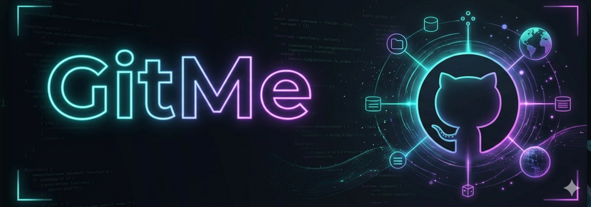

# <p align="center">GitMe</p>

<p align="center">
  
</p>

<p align="center">
  <strong>Deep Dive into Developer Impact.</strong>
</p>

<p align="center">
  
  
  
  
</p>

---

## The Philosophy

Standard GitHub profiles often fail to capture the true scale and quality of a developer's work. Contributions are frequently buried under simple "green squares" that don't differentiate between a massive architectural refactor and a typo fix.

GitMe was built to provide a more detailed, fair, and comprehensive view of your open-source journey. It extracts the narrative from your raw data—highlighting the organizations you influence, the languages you master, and the specific impact of your Pull Requests and Discussions.

## Core Capabilities

- **Detailed Work Synthesis**: Beyond just showing a profile, GitMe fetches your full profile metadata and personal README to present a complete professional identity in one view.
- **Granular Contribution Discovery**: Deep-dive into your history with categorized views for Pull Requests, Issues, and Discussions. Filter through your work to show exactly where you contributed most.
- **Multi-Year Activity Context**: Visualize your persistence over time with a multi-year contribution calendar, allowing you to track growth and consistency beyond a simple 12-month window.
- **Technical Stack Visualization**: Automatically extract and showcase your primary technologies and the organizations you've collaborated with through dynamic visual sections.
- **Contextual Work Analysis**: Uses contribution metadata to synthesize a professional summary that explains your technical expertise and the real-world impact of your code.
- **On-Demand Technical Assistant**: A persistent interface that allows recruiters or collaborators to ask specific questions about your technical background based on your live GitHub data.

---

## Tech Stack

- **Framework**: [React](https://reactjs.org/) + [Vite](https://vitejs.dev/)
- **Styling**: [Tailwind CSS](https://tailwindcss.com/) + [Lucide Icons](https://lucide.dev/)
- **Data Layer**: GitHub GraphQL API (v4)
- **Intelligence**: OpenRouter API
- **Content Engine**: `react-markdown` with GFM support

---

## Getting Started

### 1. Prerequisites
You will need:
- A GitHub Personal Access Token (classic) with `repo`, `read:user`, and `user:email` scopes.
- An OpenRouter API Key (to enable technical synthesis features).

### 2. Setup
1. Clone the repository and navigate to the `gitme` directory.
2. Create a `.env` file:
   ```env
   VITE_OPENROUTER_API_KEY=your_key_here
   ```
3. Install and run:
   ```bash
   npm install
   npm run dev
   ```

### 3. Usage
- Open `http://localhost:3000`
- Log in with your GitHub Username and Token.
- Use the **Overview** to see your high-level impact.
- Use the **Contributions** tab to browse your detailed work history with advanced filters.

---

## Security
GitMe is strictly a client-side application. Your GitHub Access Token is used only to query the GitHub GraphQL API directly from your browser. No data is stored or transmitted to external servers except for the official GitHub and OpenRouter APIs.

---

<p align="center">
  Bridging the gap between raw code and developer impact.
</p>
